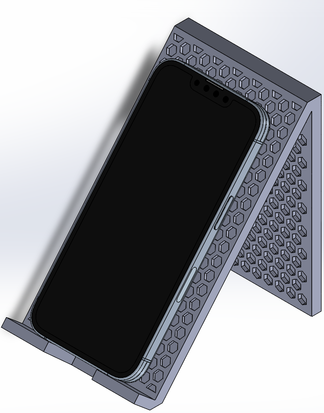

# HexStand
This is a 3D printed phone stand that has a honeycomb design pattern. It features support for charging while placed on the phone stand.

## Bill of Materials
121.33g PLA - Color of Choice

## CAD
|Phone Stand|Assembly|
|---|---|
|||

## Final Thoughts
I discovered a new tool today! SolidWorks has a "Fill Pattern" tool built into it, it made the process of placing the hexagons down way easier, and I'm definitely going to use it for my future projects.